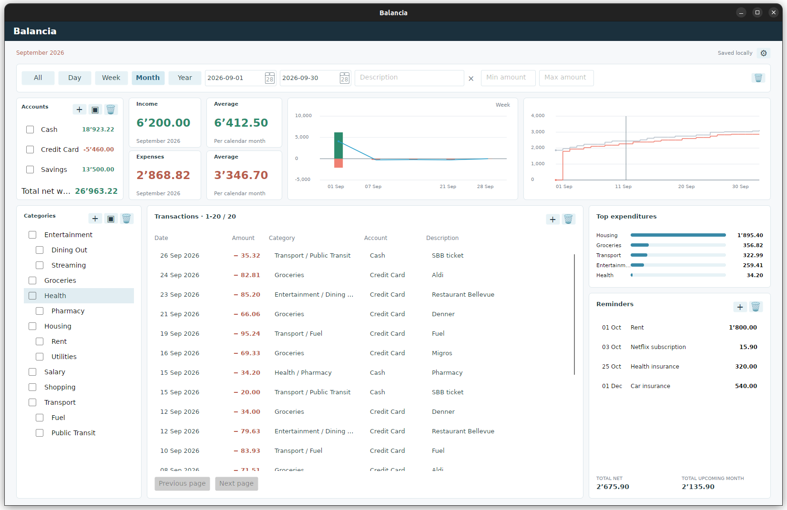

# Balancia

A personal finance ledger for Windows, with a read-only Android companion. Record income, expenses, and transfers across local accounts; browse and filter history; watch account balances, spending trends, and upcoming recurring payments — all from one local SQLite ledger, with no server and no subscription.


**Status:** the Windows ledger, CSV import/export, recurring reminders, snapshot backup/restore, and the read-only Android viewer are implemented. Release polish and distribution remain — see [docs/PLAN.md](docs/PLAN.md).

## What it does

1. Records expenses, income, and transfers against local accounts, with dated opening balances and up to two levels of categories.
2. Shows net worth, income/expense trends, and a cumulative timeline for whatever period and filters are currently selected — day, week, month, year, or a custom range.
3. Tracks recurring payments (rent, subscriptions, insurance) by description and due month, surfacing overdue and upcoming occurrences without ever creating a transaction automatically.
4. Imports the owner's existing CSV export once — matching transfers, opening balances, and categories — and exports the ledger back to CSV at any time.
5. Backs up and restores consistent local snapshots, and hands a read-only, validated copy to the Android companion for balance and history lookups on the go.

The Windows desktop is the only writer; Android never opens or synchronizes the live database. See [docs/Technical_Design_Description.md](docs/Technical_Design_Description.md) for how that boundary — and the rest of the design — works.

## UI overview

Everything lives on one Overview dashboard: a filter row (period presets, custom dates, description, and amount range) drives every card and chart below it.



- **Accounts** — balances per account, with checkboxes that feed the same filter as every other card, and total net worth below the list.
- **Income / Expenses / Average** — totals for the selected period, plus per-calendar-unit averages that account for periods with no activity.
- **Trend / Timeline** — a bar/line chart of income, expenses, and savings by day, week, or month, and a cumulative comparison against the immediately preceding period of equal length.
- **Categories** — checkbox filtering with parent/child rollup, shared with the **Top expenditures** card on the right.
- **Transaction history** — a paged, searchable, double-click-to-edit table combining every filter above.
- **Reminders** — upcoming and overdue recurring payments, with totals for everything shown and for the next calendar month.

A gear icon opens **Settings** for the database/backup/snapshot folder pickers, CSV import/export, snapshot export/restore, and the English/German/Russian/Ukrainian language picker.

## Tech stack

- **.NET 10 / Avalonia** — one shared UI toolkit for the Windows desktop app and the Android viewer
- **SQLite** (`Microsoft.Data.Sqlite`) — local relational storage, no server, no ORM
- **xUnit** — unit and SQLite integration test suite

## Project structure

| Project                                                     | Purpose                                                                                |
|:----------------------------------------------------------- |:-------------------------------------------------------------------------------------- |
| `src/Balancia.Core`                                         | Domain rules and application operations; no Avalonia, SQLite, or platform dependencies |
| `src/Balancia.Storage`                                      | SQLite schema, migrations, queries, CSV import/export, and snapshot storage            |
| `src/Balancia.Desktop`                                      | The Avalonia Windows application (full read/write UI)                                  |
| `src/Balancia.Android`                                      | The read-only Avalonia Android shell                                                   |
| `tests/Balancia.Core.Tests`, `tests/Balancia.Storage.Tests` | Unit and SQLite integration tests                                                      |

## Documentation

- [`docs/Technical_Design_Description.md`](docs/Technical_Design_Description.md) — architecture, context diagrams, and design decisions; the primary entry point for the project
- [`docs/PLAN.md`](docs/PLAN.md) — remaining/upcoming tasks
- [`docs/Coding Guidelines.md`](docs/Coding%20Guidelines.md) — C# formatting conventions
- [`AGENTS.md`](AGENTS.md) / [`MEMORY.md`](MEMORY.md) — entry point and working handoff for AI agents and contributors

## Getting started

Install .NET SDK **10.0.201**, pinned by `global.json`. All projects target `net10.0`; direct package versions are pinned in project files and `packages.lock.json` locks the transitive graph.

```powershell
dotnet restore Balancia.slnx --locked-mode
dotnet build Balancia.slnx -c Release --no-restore
dotnet test Balancia.slnx -c Release --no-build --no-restore
dotnet run --project src/Balancia.Desktop -c Release --no-build --no-restore
```

For a separate test dataset, pass `--data-dir C:\absolute\directory` after `--` in the `dotnet run` command — the app creates that directory and its schema on first run.

The app stores its working database at `%LOCALAPPDATA%\Balancia\balancia.db` by default. To import an existing CSV export, open Settings, choose **Import CSV**, inspect the preview, and apply it; a repeated identical import is a no-op, and a changed row under the same ID surfaces as a conflict instead of a silent overwrite. **Export CSV** writes the current ledger, including opening balances, in Balancia's own format.

## Private data

Committed tests use only synthetic fixtures. For a one-off reconciliation test against a real export, set `BALANCIA_PRIVATE_IMPORT_PATH` to its absolute path before running the test command, then unset it. Ignore rules do not encrypt data or remove files already tracked elsewhere.
