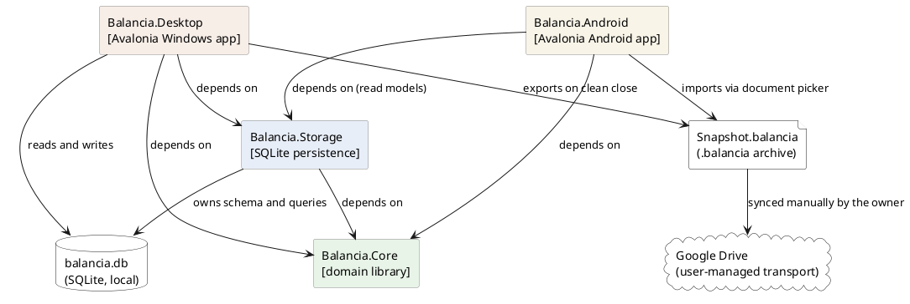
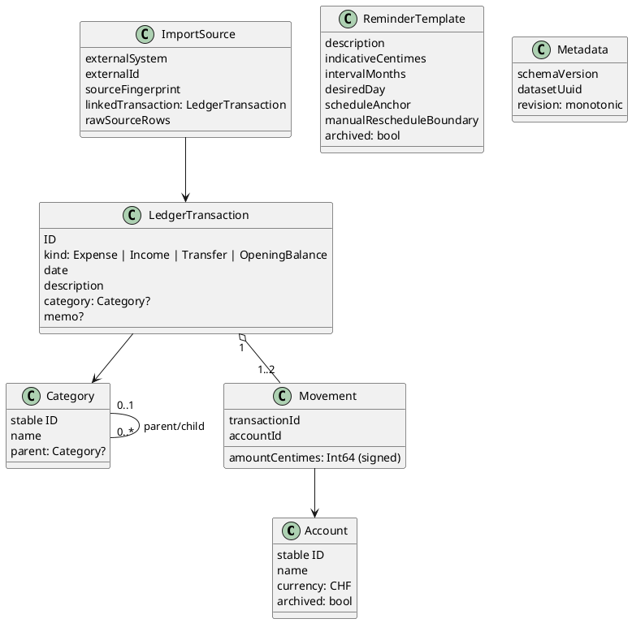
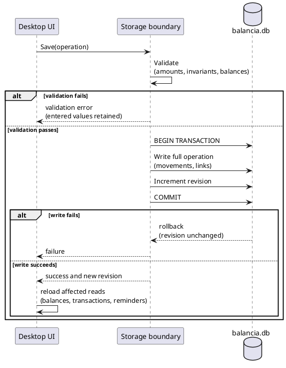
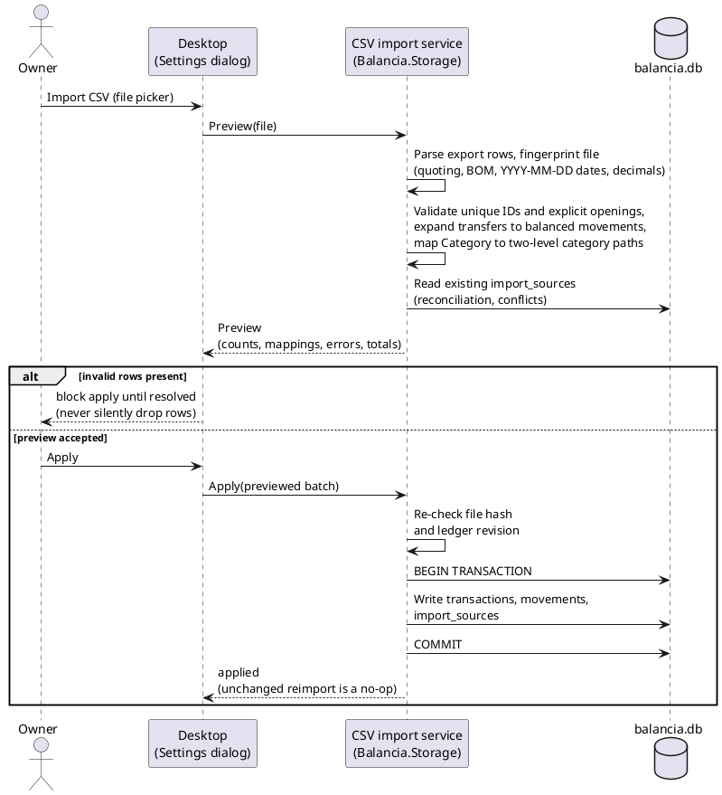
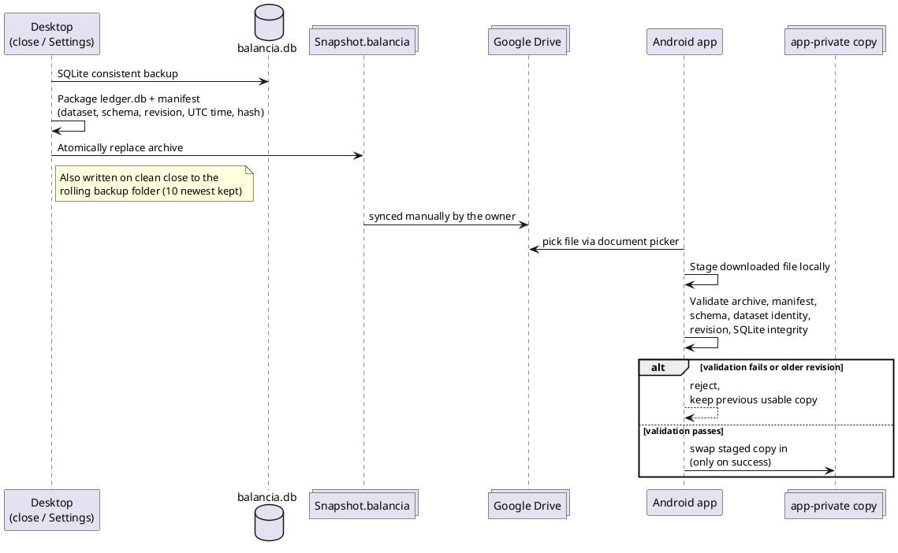

# Technical Design Description - Balancia <!-- omit from toc -->

---

**Author:** `Viacheslav Shyshkin [Developer]`
**Guideline Version:** `1.1`

**Modification History:**

- **V1.0:** by shyshkiv `28-Sep-2026`: **Initial version**.
- **V1.1:** `02-Oct-2026`: **Consolidated desktop settings persistence**.

## Table of Contents <!-- omit from toc -->

- [Purpose](#purpose)
- [Scope](#scope)
- [References](#references)
- [Abbreviations and Definitions](#abbreviations-and-definitions)
- [Unit Safety Classification](#unit-safety-classification)
- [Unit Design Notes / Decisions](#unit-design-notes--decisions)
- [Overview](#overview)
  - [Considerations for a Secure Design](#considerations-for-a-secure-design)
  - [Considerations for Localization](#considerations-for-localization)
  - [Context Map](#context-map)
- [Core Context (Balancia.Core)](#core-context-balanciacore)
  - [Domain Model](#domain-model)
  - [Money and Transfer Invariants](#money-and-transfer-invariants)
- [Storage Context (Balancia.Storage)](#storage-context-balanciastorage)
  - [Schema and Migrations](#schema-and-migrations)
  - [Ledger Write Lifecycle](#ledger-write-lifecycle)
  - [Read Queries and Indexing](#read-queries-and-indexing)
  - [CSV Import and Export](#csv-import-and-export)
  - [Reminders](#reminders)
  - [Snapshot Export, Validation, and Restore](#snapshot-export-validation-and-restore)
- [Desktop Context (Balancia.Desktop)](#desktop-context-balanciadesktop)
  - [Window Composition](#window-composition)
  - [Localization](#localization)
  - [Local Settings Persistence](#local-settings-persistence)
- [Android Context (Balancia.Android)](#android-context-balanciaandroid)
- [Non-Functional Considerations](#non-functional-considerations)
- [Open Choices](#open-choices)

---

## Purpose

This document outlines the design of **Balancia** — a single-user personal
finance ledger. Windows provides full management of accounts, transactions,
categories, and reminders; a companion Android app provides
read-only balances and history search from a manually transported snapshot.
Balancia replaces the owner's prior CSV-based workflow while preserving an
import path for Balancia's own CSV exports.

The intended audience for this document is developers and AI agents
implementing or reviewing Balancia, and anyone assessing the overall design
approach before making a change.

While this document provides a high-level design overview, for detailed
implementation information please consult the source code directly. This
document is intended to become the primary entry point for the project.

## Scope

This TDD covers all projects in the `Balancia.slnx` solution:

- **Balancia.Core** — domain rules and application operations, free of
  Avalonia, SQLite, file-picker, and cloud dependencies
- **Balancia.Storage** — SQLite schema, migrations, queries, CSV import/export,
  and snapshot storage
- **Balancia.Desktop** — the Avalonia Windows application (full read/write UI)
- **Balancia.Android** — a read-only Avalonia Android shell
- **Balancia.Core.Tests** / **Balancia.Storage.Tests** — the automated test
  suites

It describes the architectural decisions, the context boundaries, and the key
workflows of each context.

## References

| Reference | Title                                                                           |
|:--------- |:------------------------------------------------------------------------------- |
| 1         | [docs/PLAN.md](PLAN.md) — remaining/upcoming tasks                             |
| 2         | [docs/Coding Guidelines.md](Coding%20Guidelines.md) — C# formatting conventions |
| 3         | [AGENTS.md](../AGENTS.md) — agent/contributor operational entry point           |

## Abbreviations and Definitions

| Abbreviation | Description                                                                                       |
|:------------ |:------------------------------------------------------------------------------------------------- |
| TDD          | Technical Design Description                                                                      |
| ADR          | Architecture Decision Record                                                                      |
| CSV          | Comma-Separated Values                                                                            |
| WAL          | Write-Ahead Log (SQLite journaling mode)                                                          |
| UI culture   | The .NET `CultureInfo` explicitly selected for display, independent of the ambient thread culture |

## Unit Design Notes / Decisions

| Design Decision                                            | Justification                                                                                                                                            | Architectural Constraint                                                                                                                                             |
|:---------------------------------------------------------- |:-------------------------------------------------------------------------------------------------------------------------------------------------------- |:-------------------------------------------------------------------------------------------------------------------------------------------------------------------- |
| **Local Windows writer, read-only Android**                | Matches actual single-user usage; avoids server operations and multi-writer conflict resolution.                                                         | Android never opens the live database for write; it only imports validated, immutable snapshots.                                                                     |
| **C#/.NET, Avalonia, SQLite**                              | Shared language and domain logic across desktop and mobile; desktop-first UI; local relational persistence with no server dependency.                    | `Balancia.Core` must stay free of Avalonia/SQLite/cloud dependencies so it is reusable by both shells and testable in isolation.                                     |
| **One logical transfer, two atomic movements**             | Preserves account balances during every edit and excludes transfers from income/expense totals.                                                          | Create, edit, and delete of a transfer must update both movements inside one database transaction; a partial write must roll back entirely.                          |
| **Immutable snapshots via user-managed Drive transport**   | No hosted API is required; stale mobile data is acceptable; the live database is never synced directly.                                                  | Snapshot export/import must be self-contained (schema, dataset identity, revision, integrity hash) so Android can validate a file without contacting Windows.        |
| **Description + occurrence month/year for recurrence**     | The user defines recurrence manually; no fuzzy matching, amount matching, or bank integration is in scope.                                               | Reminder satisfaction compares only the exact description against the transaction's calendar month/year; amount and day never participate.                           |
| **Money as signed 64-bit integer centimes**                | Binary floating point cannot represent currency amounts exactly and would risk silent rounding drift across thousands of transactions.                   | All monetary fields use checked `Int64` centime arithmetic; parsing rejects fractional centimes, overflow, and non-decimal input.                                    |
| **No generic repository over every table**                 | Storage exposes the specific reads/writes each application operation needs (e.g. `TransactionsFilter`, `ReadFlowAnalytics`) rather than a generic CRUD layer. | New query needs are added as purpose-built, parameterized SQL rather than generalized through an ORM abstraction.                                                    |
| **Explicit UI culture over ambient thread culture**        | Async filter refreshes previously reverted labels to the ambient thread culture after a language switch, showing stale text.                             | All resource lookups and date-picker calendar captions use the explicitly selected `CultureInfo`, not `CultureInfo.CurrentUICulture` read from the executing thread. |
| **`MainWindow` split into feature-scoped partial classes** | A single monolithic window file became too large to navigate as Overview, Transactions, Categories, Reminders, Accounts, and Settings UI grew.           | Each partial file owns one feature area's controls and handlers; `MainWindow.axaml.cs` retains only shared state, initialization, refresh, and navigation.           |

## Overview

Balancia's lifecycle centers on one local SQLite ledger that the Windows
desktop app owns exclusively:

1. The owner records income, expenses, transfers, and dated opening balances
   through the Windows Overview dashboard, or imports them from a CSV export
   of the prior tracking tool.
2. Categories (up to two levels) and reminder templates classify and
   forecast transactions; reminders track unresolved occurrences without ever
   creating transactions automatically.
3. Every successful write validates domain invariants inside one database
   transaction, increments a monotonic revision, and refreshes the affected
   dashboard reads in place.
4. On a clean close, Windows exports a consistent snapshot (`.balancia`
   archive) to an optional rolling backup folder and to a fixed
   `Snapshot.balancia` file in a separate folder intended for manual Google
   Drive synchronization.
5. Android imports that snapshot through the system document picker, validates
   it (schema, dataset identity, revision, integrity), and swaps its app-local
   copy only on success — the live Windows database is never synced directly.

### Considerations for a Secure Design

Balancia has no server component and no network API of its own; all data
stays on the owner's devices. Google Drive is used only as user-managed file
transport for snapshots, never as an active database. The private CSV import
source and any live database/backup/snapshot files are excluded from source
control by ignore rules; committed tests use only synthetic financial data.
Snapshot integrity hashes detect corruption, not malicious authenticity —
Balancia does not currently sign or encrypt exported archives (see
[Open Choices](#open-choices)).

### Considerations for Localization

The Windows desktop supports English, German, Russian, and Ukrainian, selected
through a flag-marked picker in Settings. A missing preference resolves from
the process's Windows UI culture, with English fallback; the choice persists
in the application settings file and updates the open window immediately,
including date-picker calendar captions and Russian/Ukrainian month-name
capitalization. The application name `Balancia` is never translated. Android
is outside this translation scope. See [Localization](#localization) for the
implementation detail.

### Context Map

## Core Context (Balancia.Core)

`Balancia.Core` holds domain rules and application operations shared by both
shells. It has no Avalonia, SQLite, file-picker, or cloud dependencies, which
keeps it directly unit-testable and reusable by Android without pulling in
desktop-only code.

### Domain Model

- **Expense** has one negative movement; **Income** has one positive movement;
  **Transfer** has two movements summing to zero across two different
  accounts; **OpeningBalance** has one signed movement with an effective date.
- Account balance = opening balance + all signed movements after the opening
  point; net worth = the sum of account balances. Balances are recomputed from
  indexed movements rather than independently persisted, until measurement
  justifies a cache.
- Categories nest at most two levels; a parent category filter includes its
  children without double-counting overlaps.

### Money and Transfer Invariants

- Money is a signed 64-bit integer count of centimes, using checked arithmetic
  and decimal parsing; binary floating point is never used for monetary
  values.
- Zero amounts, fractional centimes, overflow, and same-account transfers are
  rejected at the domain boundary.
- A transfer is one logical operation: creating, editing, or deleting it
  always affects both accounts atomically. The transaction list renders it as
  a single entry; per-account views show its signed effect on that account
  only.
- Dates use `DateOnly` semantics for financial dates (no time zone) and UTC
  instants for snapshot metadata.

## Storage Context (Balancia.Storage)

`Balancia.Storage` implements the persistence boundaries required by Core's
operations directly against SQLite — there is no generic repository for every
table. It owns the schema, all parameterized queries, CSV import/export, the
reminder calculation, and snapshot lifecycle.

### Schema and Migrations

A consistent SQLite backup is written beside the database before any
migration runs. Opening a database with an unsupported (newer) schema version
fails without changing it. Every logical write happens inside a database
transaction with foreign keys and uniqueness/check constraints enforced;
cross-row invariants (balances, monthly totals) are verified before commit.

### Ledger Write Lifecycle

A failed operation never emits a successful revision. A clock is injected for
month-change and recurrence tests. Reminder satisfaction is recomputed after
every transaction change.

### Read Queries and Indexing

- `TransactionsFilter` combines an optional category-ID set with the existing
  single-category filter; shared read/count/aggregate predicates use a
  parameterized JSON array with SQLite `json_each`, matching a category or its
  parent without joining and multiplying rows.
- `ReadFlowAnalytics` reuses that same predicate to read current and prior
  periods in one SQLite read transaction for the Trend/Timeline charts; Core
  groups the daily amounts into calendar buckets with checked `Money`
  arithmetic.
- Transactions pages use a stable date/ID cursor of 100 rows instead of
  loading every row; a count query supports result totals. The write path
  checks movement and month totals without materializing every transaction
  entry.
- Candidate indexes: ledger date + stable ID; movement account + transaction;
  category + date through query design; description/date for recurrence. A
  leading-wildcard substring search (description search) may scan
  descriptions; exact index selection follows measured query plans rather than
  being assumed, and full-text search is not added without a measured need.
- An SQLite connection function delegates substring comparison to .NET
  ordinal case-insensitive matching so accented case pairs match consistently.

### CSV Import and Export

Import accepts only Balancia's nine-column export structure, in this order:
ID, Date, Type, Description, Amount, Account, DestinationAccount, Category, Memo.
Dates use YYYY-MM-DD; expenses have negative amounts, income and transfers
have positive amounts, and OpeningBalance amounts may be positive, negative,
or zero. Every account has exactly one explicit OpeningBalance row. A transfer
is one row with different source and destination accounts and no category.
IDs must be unique within a file. A repeated import with unchanged IDs and data
is a no-op; changed data or local edits produce a conflict. The old eleven-column
format is rejected at preview before any writes.

Export CSV writes all account opening balances and posted transactions from
one consistent ledger read, one row per logical transaction (including
transfers), with columns ID, Date, Type, Description, Amount, Account,
DestinationAccount, Category, Memo. Import and export share the same header.
The existing target file is replaced only after the write completes.

### Reminders

The desktop reminder subtotal shows **UPCOMING THIS MONTH** and sums unsatisfied
occurrences in the current calendar month whenever any remain (including overdue
dates in that month). Otherwise it shows **UPCOMING NEXT MONTH** and sums
unsatisfied occurrences in the next calendar month. Older overdue occurrences
remain in the reminder list but do not enter either monthly subtotal.
The overall reminder total is labeled **TOTAL**. All three total labels use
uppercase translations in every supported desktop language.

Unsatisfied reminders show their date, description, and amount in red when
overdue, and in a readable golden yellow when due today through five days from
today (inclusive). Both highlighted groups use bold text across all three
columns. Remaining pending reminders are blue in the next calendar month and
green in subsequent months, including across year boundaries. The overdue and
five-day rules take precedence over month colors. Other reminders retain the
normal text color; later reminders retain their normal font weights.

An occurrence is satisfied when a posted transaction has exactly the
template's description and falls within that occurrence's calendar month and
year; day and amount never participate, and account/category are not
additional matching keys. On satisfaction the next occurrence is the current
one advanced by the template's interval in months, even if the matching payment
is entered before the expected day in that same month. Unmatched past occurrences
remain visible as overdue until paid or manually rescheduled — the calendar
advancing never silently skips or auto-creates a transaction.

| Rule                   | Behavior                                                                                                                                                                                                      |
|:---------------------- |:------------------------------------------------------------------------------------------------------------------------------------------------------------------------------------------------------------- |
| Satisfaction source    | Recomputed from current transactions plus a persisted schedule anchor; no irreversible cursor, so editing/deleting a matching payment can reopen an occurrence.                                               |
| Repeated matches       | Multiple matching payments in one month satisfy that occurrence only once; later months still need their own match.                                                                                           |
| Manual reschedule      | Moves only the outstanding occurrence and establishes the new cadence going forward; earlier occurrences are not regenerated. The reschedule boundary is stored separately from payment-derived satisfaction. |
| Day clamping           | The desired day is preserved across months and clamped at month end when absent (e.g. Jan 31 → Feb 28/29 → Mar 31), rather than drifting permanently to the clamped day.                                      |
| Duplicate descriptions | Two active templates with identical descriptions are ambiguous and must be made distinct; there is no fuzzy or amount-based disambiguation.                                                                   |

### Snapshot Export, Validation, and Restore

Snapshot export uses SQLite's consistent backup facilities (or an equivalent
consistent logical export), never a raw copy of an open WAL database. The
archive's hash detects corruption, not malicious authenticity. Before a schema
migration a separate, timestamped `.pre-restore-*`/`.bak` recovery copy is
written so restoration can be tested independently of the migration path. An
older revision is rejected by default; deliberate restore is a distinct,
explicit action from the automatic refresh flow.

## Desktop Context (Balancia.Desktop)

`Balancia.Desktop` is the full read/write Avalonia Windows application. It
invokes Core operations and reads Storage query results directly; it never
re-implements persistence logic itself.

### Window Composition

`MainWindow` is split into partial classes by responsibility, so each source
file stays scoped to one feature area:

| File                                | Responsibility                                                    |
|:----------------------------------- |:----------------------------------------------------------------- |
| `MainWindow.axaml.cs`               | Shared state, initialization, refresh, navigation, page selection |
| `MainWindow.Overview.cs`            | Assembles and refreshes the Overview dashboard                    |
| `MainWindow.FilterState.cs`         | Owns Overview period and filter state                             |
| `MainWindow.FiltersPanel.cs`        | Builds the Overview filter row controls                           |
| `MainWindow.TransactionsPanel.cs`   | Builds the paged transactions card                                 |
| `MainWindow.CategoriesPanel.cs`     | Builds the largest-expense-categories card                        |
| `MainWindow.Transactions.cs`        | Transaction add/edit/delete dialogs                               |
| `MainWindow.Categories.cs`          | Category management and checkbox filtering                        |
| `MainWindow.RemindersPanel.cs`      | Reminders card and template add/edit                              |
| `MainWindow.Accounts.cs`            | Accounts card and account add/edit/archive                        |
| `MainWindow.DataTransfer.cs`        | CSV import/export and snapshot export/restore actions             |
| `MainWindow.Settings.cs`            | The modal Settings dialog and folder pickers                      |
| `MainWindow.UiHelpers.cs`           | Shared controls and dialog helpers                                |

The Overview dashboard is the single transaction-editing surface (there is no
separate Transactions page); filter and period changes update mounted
controls in place rather than rebuilding the page, so focus and scroll
position are preserved. Category, account, and reminder-template management
live in their respective Overview cards rather than dedicated pages.

Accounts highlights the configured default account row with a blue background
slightly darker than normal selection, extending 2px beyond the content on each
side without adding text. The highlight
refreshes after saving the account and remains independent of filter selection.

Period filter buttons are All, Today, Week, Month, and Year, localized in all
four desktop languages. Today selects the current local date; Day remains the
name of the daily chart granularity.

Closed desktop date pickers support unmodified Up/Down keys while focused:
Up and mouse wheel up select the next day; Down and wheel down select the previous day.
Empty dates stay empty; date limits and blackout dates are respected. Open
calendar keyboard navigation remains unchanged.

### Localization

Resource lookup uses the explicitly selected `CultureInfo`, never the ambient
thread culture picked up by async continuations — this was a deliberate fix
after filter refreshes reverted labels to the wrong language. Date pickers
rebuild their calendar month/weekday captions under the selected culture on
open and on navigation; Russian and Ukrainian date cultures additionally
capitalize full, abbreviated, and genitive month names. The selected language
code (`en`, `de`, `ru`, `uk`) is optional in application settings; it is only
written when the owner explicitly selects a language, not as a side effect of
other settings changes.

### Local Settings Persistence

- One `%LOCALAPPDATA%\Balancia\settings.json` stores window width,
  height, and position, plus the optional backup folder, snapshot folder,
  default account, and explicitly chosen language. Writes replace the file
  atomically; invalid optional window geometry does not block ledger startup.
- The settings path is fixed regardless of the active database directory.
  Startup reads the database path from this file, using the default user
  directory when no path is saved. Settings provides database, backup, and
  snapshot folder selectors; all three paths persist in the same settings file.
- No registry access or legacy settings migration is performed. `window.json`
  and settings files beside a custom database are not loaded. `--data-dir`
  overrides the database for a temporary session and does not write preferences.

## Android Context (Balancia.Android)

`Balancia.Android` is a read-only Avalonia shell targeting `net10.0-android`.
It reuses Core's domain rules and Storage's read models and queries, not a
writable desktop service surface. It shows net worth, account balances,
transaction history with description search, and a visible snapshot update
time; it never modifies financial data. Importing a new snapshot follows the
staging/validation/swap sequence in
[Snapshot Export, Validation, and Restore](#snapshot-export-validation-and-restore):
the selected document is copied into app-private staging, validated, and
swapped in only on success, so an interrupted transfer or a failed import
keeps the prior working copy.

## Non-Functional Considerations

A synthetic 50,000-transaction dataset targets warm filtered/search pages and
a committed dashboard refresh within 200 ms at p95 on the development Windows
machine, excluding human interaction and sync — a target, not a guaranteed
bound. On an Intel Core i9-14900K Release build, measured storage/query p95
figures were: 68.8 ms first page, 50.9 ms deep cursor page, 49.6 ms search,
86.3 ms combined filter, 33.9 ms dashboard read, and 104.2 ms for a committed
edit plus dashboard refresh. These are storage/query timings only; end-to-end
Avalonia rendering time is not included, and they do not currently justify a
balance cache or full-text index.

## Open Choices

The following are acknowledged as unresolved implementation choices rather
than accepted design decisions:

- Windows distribution/update method and Android sideload packaging.
- Snapshot encryption, backup retention policy beyond the current fixed count,
  and a full end-to-end restore UX.
- Android document-provider compatibility across devices, and whether
  automatic (rather than manual, close-triggered) export adds value.
- End-to-end UI latency at 50,000 rows, beyond the measured storage/query
  timings above.
